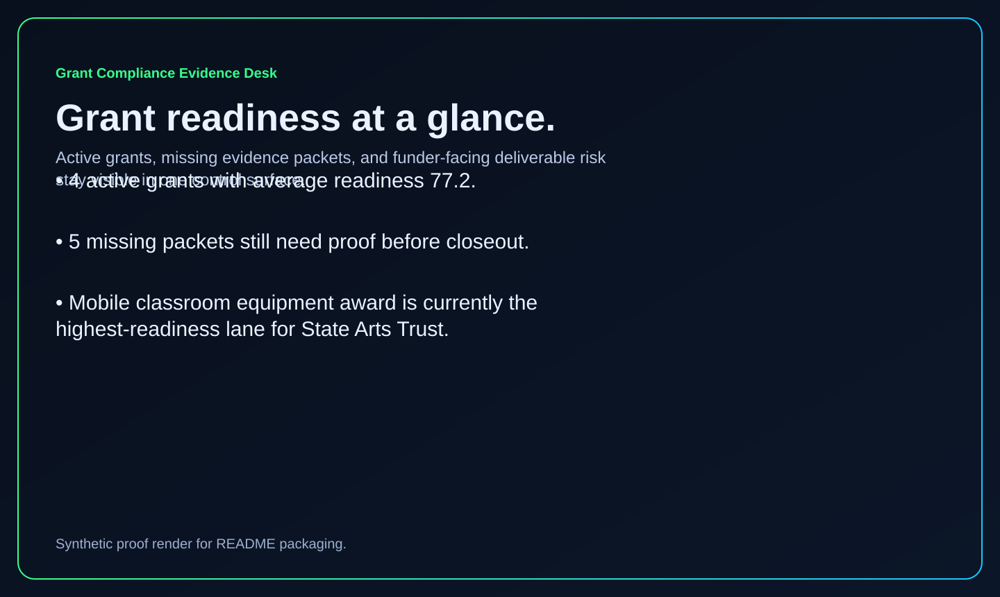
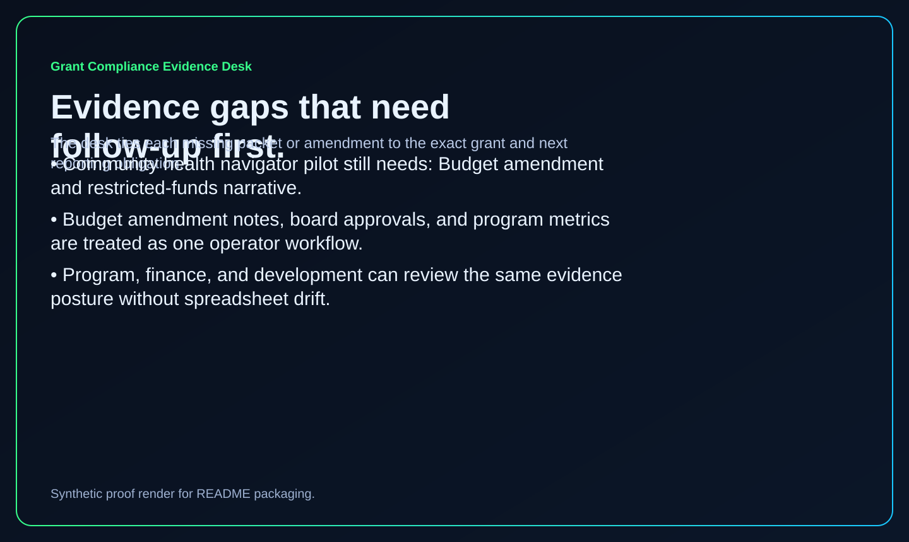
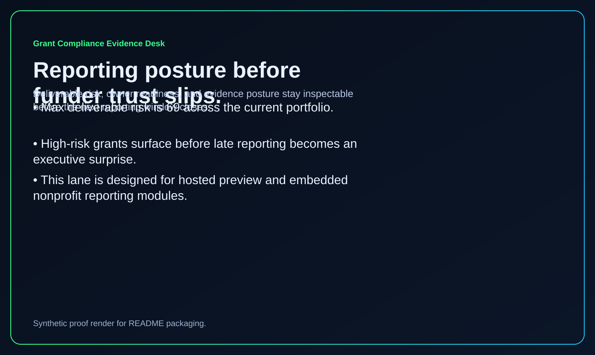

# grant-compliance-evidence-desk

Nonprofit operator surface for grant evidence, reporting posture, budget amendments, and deliverable readiness.

## What it shows

- a local-first Python + SQLite desk for nonprofit grant compliance and funder reporting posture
- modeled grants, funders, evidence packets, and reporting cycles that surface missing proof before reporting windows slip
- a crawlable static custom-domain surface published from the same desk output

## Routes

- `/`
- `/grant-lane/`
- `/evidence-gaps/`
- `/reporting-posture/`
- `/verification/`
- `/docs/`

## Local development

```powershell
python scripts\run_demo.py
python scripts\generate_site.py
```

## Validation

```powershell
python -m pytest
python scripts\smoke_check.py
python scripts\render_readme_assets.py
```

## Screenshots





## Why this matters

This repo extends the nonprofit / foundation ops lane with a real operator primitive: grant evidence should not live as fragmented inbox follow-up between development, finance, and program teams. The desk keeps missing proof, amendment posture, and deliverable risk inspectable before funder trust degrades.

Kinetic Gain Embedded tie-back:

This surface shows how Kinetic Gain can package grant operations into a buyer-readable evidence workflow, with a direct path to hosted review lanes, paid templates, and embedded nonprofit reporting modules.

## Embedded tie-back

See [docs/KINETIC_GAIN_EMBEDDED.md](./docs/KINETIC_GAIN_EMBEDDED.md).

---

Part of the [Kinetic Gain Suite](https://suite.kineticgain.com/) operator portfolio · apex: [kineticgain.com](https://kineticgain.com) · live: [grants.kineticgain.com](https://grants.kineticgain.com/)
